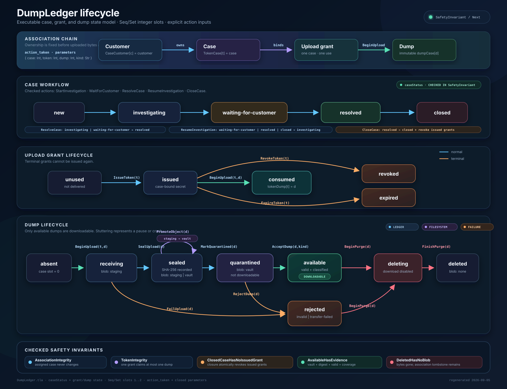
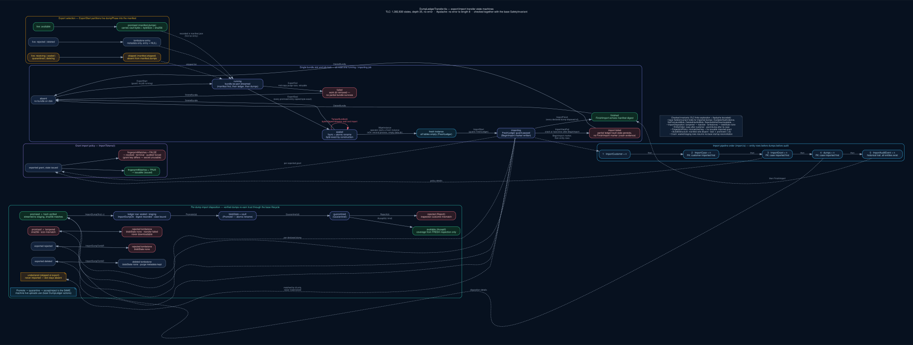

# DumpLedger formal specification

`DumpLedger.tla` is a finite executable model of operator-controlled case
workflow, closure-time grant revocation, one-time grant consumption, immutable
case association, crash-sensitive object promotion, validation, availability,
rejection, and purge.



Run the complete finite-state exploration with TLC:

```sh
tlc -config specs/DumpLedger.cfg specs/DumpLedger.tla
```

Run a bounded symbolic check with Apalache:

```sh
apalache-mc check \
  --no-deadlock \
  --init=Init \
  --next=Next \
  --inv=SafetyInvariant \
  --length=8 \
  specs/DumpLedger.tla
```



`DumpLedgerTransfer.tla` is a companion model of the export/import
transfer behavior (`docs/import-export-design.md`). It extends DumpLedger with
one abstract bundle slot and a single-job transfer lock, reuses the base dump
lifecycle actions so imported dumps re-earn `available` through quarantine,
and checks the bundle-integrity, empty-ledger-precondition, tamper-rejection,
and grant-key-fingerprint policies. The grant-key fingerprint match is chosen
once per behavior, so one run covers both policies. It is deliberately
outside the generated model interface and MBT corpus: `DumpLedger.tla` stays
byte-identical and the trace tooling ignores this file.

```sh
tlc -config specs/DumpLedgerTransfer.cfg specs/DumpLedgerTransfer.tla

apalache-mc check   --no-deadlock   --init=TransferInit   --next=TransferNext   --inv=TransferSafetyFull   --length=8   specs/DumpLedgerTransfer.tla
```

The diagram `DumpLedgerTransfer.svg` is generated from the checked-in
`DumpLedgerTransfer.dot` source; regenerate after editing with
`dot -Tsvg specs/DumpLedgerTransfer.dot -o specs/DumpLedgerTransfer.svg`.

`mbt/` contains falsifiable witness invariants used by MirrorECMA
`runClientGenTraces`. The resulting Apalache traces live under
`test/fixtures/mbt/traces/`; they are generation evidence, not substitutes for
the complete TLC check or bounded `SafetyInvariant` check.

The current case-workflow revision is specification-only. The checked-in model
interface and MBT traces still describe the earlier grant/dump-only model and
must remain visibly stale until the runtime implementation and generated
artifacts are refreshed together.

See `docs/formal-model.md` for the abstraction map and evidence limits.
